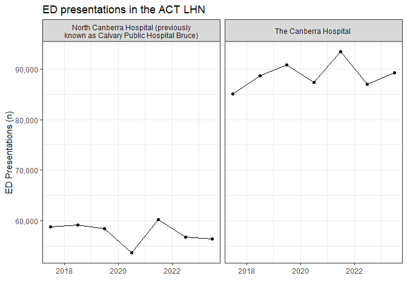

<!-- README.md is generated from README.Rmd. Please edit that file -->

# readaihw

<!-- badges: start -->

[](https://lifecycle.r-lib.org/articles/stages.html#experimental)
[](https://CRAN.R-project.org/package=readaihw)
[](https://github.com/RWParsons/readaihw/actions/workflows/R-CMD-check.yaml)
[](https://app.codecov.io/gh/RWParsons/readaihw)
<!-- badges: end -->

The purpose of `readaihw` is to provide access to the MyHospitals API so
that hospital data from the AIHW can be accessed directly from R. For
details about what data are provided by the AIHW see
[here](https://www.aihw.gov.au/about-our-data/our-data-collections). See
[here](https://www.aihw.gov.au/reports-data/myhospitals/content/api) for
details about the [MyHospital
API](https://myhospitalsapi.aihw.gov.au/index.html).

## Installation

You can install the development version of readaihw like so:

``` r
# install.packages("pak")
pak::pkg_install("RWParsons/readaihw")
```

## Example - ED presentations

This example gets data on hospital presentations and presents these
counts as a graph for hospitals in the Metro South (Qld) local hospital
network over time.

``` r
library(readaihw)
library(dplyr)
library(ggplot2)

ed_presentations <- read_flat_data_extract("MYH-ED")

msh_hospital_codes <- get_hospital_mappings() |>
  filter(
    local_hospital_network_lhn == "Metro South (Qld)",
    type == "Hospital"
  ) |>
  pull(code)

ed_presentations |>
  filter(reporting_unit_code %in% msh_hospital_codes) |>
  select(date = reporting_end_date, hospital = reporting_unit_name, value) |>
  mutate(value = as.numeric(value), date = lubridate::ymd(date)) |>
  summarize(count = sum(value, na.rm = TRUE), .by = c(hospital, date)) |>
  ggplot(aes(date, count)) +
  geom_line() +
  geom_point() +
  facet_wrap(~ stringr::str_wrap(hospital, 40)) +
  theme_bw() +
  scale_y_continuous(labels = scales::label_comma()) +
  labs(x = "", y = "ED Presentations (n)", title = "ED presentations in the Metro South (Qld) LHN")
```


